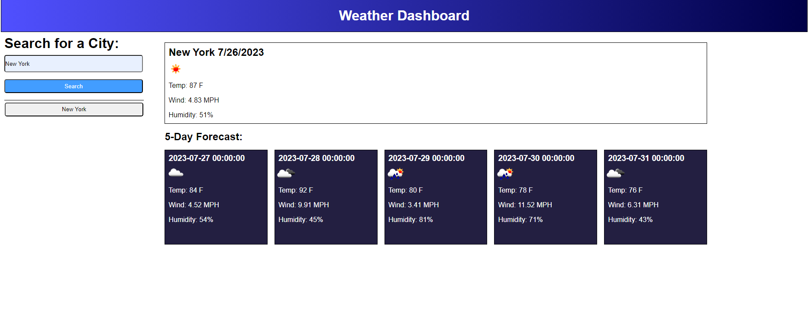

# Module-6-Challenge

## Description

When you type a city into the search bar, it displays that day's weather, and the five days to come. When you click on the recently searched city, it should display that city's weather. 

## Installation

No installation needed, just go to the deployed application link below.

Deployed application - https://toosparky.github.io/module-6-challenge/

## Usage

To use, all you need to do is click on the search bar in the top left of the page, and search for a city. The application should do all the rest.

## Credits

Zach Barnes - https://github.com/TooSparky

## License

No current licenses.
